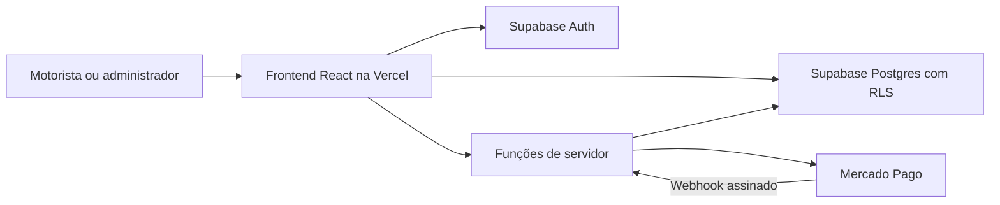

# Contas, administração e assinaturas

## Objetivo

Transformar o Giro Certo em um serviço com contas individuais. Cada motorista registra e consulta apenas seus próprios dados; o administrador acompanha contas, assinaturas e o faturamento registrado por usuário. Planos pagos serão liberados ou bloqueados pelo servidor conforme a assinatura.

Esta evolução substitui a persistência somente no navegador por dados associados a uma conta em banco de dados.

## Papéis

| Papel | Permissões |
| --- | --- |
| Visitante | Criar conta, entrar, recuperar senha e conhecer os planos. |
| Motorista | Manter perfil, veículo, jornadas, despesas e relatórios próprios enquanto o acesso estiver ativo. |
| Administrador | Consultar usuários, assinaturas e indicadores agregados; bloquear ou liberar uma conta com justificativa. |
| Mercado Pago | Comunicar alterações de assinatura por webhook, sem acesso à interface. |

O papel de administrador não será selecionado no cadastro. Ele será atribuído por uma rotina administrativa protegida.

## Casos de uso

| ID | Ator | Caso | Fluxo | Resultado |
| --- | --- | --- | --- | --- |
| UC01 | Visitante | Criar conta | Informa nome, e-mail e senha; confirma e-mail. | Perfil de motorista criado com teste ou plano definido. |
| UC02 | Motorista | Entrar e sair | Autentica com e-mail e senha. | Sessão segura renovada pelo provedor. |
| UC03 | Motorista ativo | Registrar corrida ou despesa | Informa dados e salva. | Registro é associado exclusivamente ao seu `user_id`. |
| UC04 | Motorista | Consultar resultado | Escolhe período e veículo. | Vê apenas os próprios dados e lucro. |
| UC05 | Administrador | Consultar usuários | Filtra por status, plano ou período. | Vê situação de assinatura e indicadores por usuário. |
| UC06 | Administrador | Consultar faturamento | Seleciona usuário e período. | Vê receita, despesas e resultado operacional do motorista. |
| UC07 | Motorista | Assinar ou renovar | Escolhe plano e conclui checkout. | Assinatura é criada; o servidor aguarda confirmação. |
| UC08 | Mercado Pago | Confirmar pagamento | Envia webhook assinado. | Assinatura e direito de acesso são atualizados uma vez. |
| UC09 | Sistema | Restringir conta vencida | Confere acesso antes da operação protegida. | Mostra regularização e bloqueia recursos pagos. |
| UC10 | Administrador | Bloquear ou liberar | Registra motivo e data. | Decisão auditável e efetiva até nova alteração. |

## Regras de negócio

### Identidade e dados

- RA01: e-mail é único, normalizado em minúsculas, e a senha nunca é armazenada pelo aplicativo; ela é tratada pelo provedor de autenticação.
- RA02: cada veículo, jornada, receita e despesa possui `user_id` obrigatório e imutável.
- RA03: motorista só lê, cria, altera ou exclui linhas cujo `user_id` é o seu. Essa regra é aplicada no banco, não apenas na interface.
- RA04: administrador recebe a permissão apenas por procedimento protegido e também usa uma conta autenticada.
- RA05: o painel administrativo não exibe senha, token, dados de cartão ou segredos de pagamento.

### Planos e acesso

- RA06: a conta possui `access_status`: `trial`, `active`, `past_due`, `suspended`, `canceled` ou `blocked`.
- RA07: `trial` e `active` autorizam recursos do plano. `past_due` pode ter tolerância definida pelo negócio. `suspended`, `canceled` e `blocked` não autorizam recursos pagos.
- RA08: `blocked` é uma decisão manual e não pode ser sobrescrita automaticamente por um pagamento.
- RA09: o servidor verifica a assinatura em toda operação protegida. Esconder botões é apenas experiência de uso, não segurança.
- RA10: ao vencer, os dados são preservados e a pessoa vê a página de regularização; inadimplência não apaga dados.
- RA11: a confirmação de pagamento vem de webhook validado e consulta ao provedor, nunca apenas do retorno do navegador.
- RA12: cada evento externo possui identificador único, data e resultado; reenvio de webhook não duplica cobrança nem muda o estado duas vezes.
- RA13: “faturamento do motorista” no painel significa receita lançada no app, e “resultado” significa receita menos despesas, segundo `regras_de_negocio.md`.
- RA14: bloqueios e liberações manuais registram administrador, motivo, data, estado anterior e novo estado.

## Solução técnica sugerida

### Arquitetura recomendada

Usar **Supabase** como backend gerenciado e **Vercel** para publicar o frontend React/Vite. O Supabase fornece PostgreSQL, autenticação, políticas de acesso e funções de servidor; a Vercel publica o site com HTTPS, domínio e deploy pelo repositório.

O frontend pode acessar dados comuns com a chave pública do Supabase. Todas as tabelas expostas usam **Row Level Security (RLS)** para que cada motorista alcance apenas suas linhas. Operações privilegiadas — painel administrativo, checkout, webhook e atualização de assinatura — rodam em funções de servidor. A chave secreta do Supabase e as credenciais do Mercado Pago ficam exclusivamente nelas.

A solução evita operar servidor Node, banco, certificados e processos contínuos no início. O backend Node atual pode continuar durante o desenvolvimento, mas a versão com login deve mover as operações persistentes para o banco e as funções protegidas. Os cálculos puros podem continuar em TypeScript compartilhado.

### Modelo de dados inicial

| Tabela | Campos principais | Finalidade |
| --- | --- | --- |
| `profiles` | `id` (FK de `auth.users`), nome, papel, criado_em | Perfil e papel. |
| `vehicles` | id, `user_id`, nome, consumo, ativo | Veículos de cada motorista. |
| `rides` | id, `user_id`, veículo, início/fim, km, valores | Jornadas/corridas e dados para cálculo. |
| `expenses` | id, `user_id`, veículo, categoria, valor_centavos, data | Custos registrados. |
| `plans` | id, nome, preço, período, recursos | Catálogo de planos. |
| `subscriptions` | id, `user_id`, plano, provedor, id_externo, status, período_fim | Direito de acesso. |
| `access_overrides` | id, `user_id`, status, motivo, `admin_id`, criado_em | Bloqueios e liberações manuais. |
| `payment_events` | id_externo, tipo, recebido_em, processado_em, resultado | Idempotência dos webhooks. |
| `audit_logs` | ator, ação, entidade, entidade_id, antes, depois, criado_em | Auditoria. |

Guardar dinheiro em centavos inteiros. Criar índices em `user_id`, datas e status de assinatura.

### Pagamentos

Para o público brasileiro, a primeira integração sugerida é **Mercado Pago Assinaturas**, que realiza cobrança recorrente e envia webhooks.

1. O motorista escolhe o plano e chama a função autenticada `create-checkout`.
2. A função cria ou recupera cliente e assinatura no Mercado Pago, guardando somente identificadores externos.
3. O navegador segue para o checkout.
4. O Mercado Pago chama `payment-webhook`; a função valida a assinatura HMAC e consulta o estado oficial.
5. A função atualiza a assinatura e recalcula o acesso em uma transação.
6. Cada recurso pago confirma o acesso vigente no servidor.

Nunca colocar dados de cartão, senha, `service_role` ou tokens privados no frontend ou no Git.

## Formas de implementação avaliadas

| Opção | Vantagens | Limitações | Decisão |
| --- | --- | --- | --- |
| Supabase + Vercel + Mercado Pago | Menos infraestrutura; Auth e Postgres integrados; RLS e funções para webhooks. | Dependência de serviços externos e custo conforme cresce. | **Recomendada para lançar.** |
| API Node própria + PostgreSQL gerenciado + Vercel | Liberdade total sobre a API atual. | API, autenticação, atualização e monitoramento separados. | Usar se regras do backend ficarem muito específicas. |
| Firebase + hosting | Serviços gerenciados e boa autenticação. | NoSQL torna relatórios financeiros relacionais mais trabalhosos. | Não é a primeira escolha. |
| VPS própria | Controle completo. | Segurança, backups, deploy e disponibilidade são responsabilidade do projeto. | Evitar no início. |

## Hospedagem recomendada

| Componente | Serviço | Motivo |
| --- | --- | --- |
| Frontend React/Vite | Vercel | Publicação simples, HTTPS e integração com Git. |
| Autenticação, banco e funções | Supabase | Auth, PostgreSQL, RLS, backups e funções no mesmo projeto. |
| Cobrança recorrente | Mercado Pago | Assinaturas adequadas ao Brasil e webhooks para sincronizar acesso. |
| E-mail transacional futuro | Resend ou similar | Confirmação de conta, aviso de vencimento e recuperação de acesso. |

Antes de produção, configurar domínio próprio, URLs de redirecionamento de autenticação, variáveis de ambiente, backup testado, alertas de falha de webhook e política de privacidade/LGPD. Custos e limites devem ser confirmados nas páginas oficiais na data da contratação.

## Entregas em ordem

1. Modelar o banco, criar migrações e habilitar RLS em todas as tabelas expostas.
2. Implementar cadastro, confirmação de e-mail, login, recuperação de senha e proteção de rotas.
3. Migrar jornadas, receitas, despesas e veículos para registros vinculados ao usuário autenticado.
4. Criar painel administrativo por funções ou consultas privilegiadas, com auditoria.
5. Definir planos, teste grátis e tolerância; implementar estados de acesso sem cobrança real.
6. Integrar Mercado Pago em testes, cobrindo webhooks duplicados, inválidos, aprovados, recusados e cancelados.
7. Publicar em Vercel e Supabase, configurar domínio, monitoramento, backups e revisão de segurança antes de pagamentos reais.

## Critérios de aceite

- A conta A não consegue obter ou alterar nenhum lançamento da conta B, mesmo alterando requisições do navegador.
- O administrador autenticado consulta indicadores sem acesso a senhas, tokens ou dados de pagamento.
- Usuário `active` usa recursos do plano; `blocked` recebe resposta de acesso negado no servidor e tela de regularização.
- Webhook aprovado ativa acesso uma única vez; evento sem assinatura válida é rejeitado.
- Todo bloqueio ou liberação manual aparece na auditoria.

## Referências técnicas

- [Supabase Auth](https://supabase.com/docs/guides/auth/architecture) e [segurança de dados](https://supabase.com/docs/guides/database/secure-data).
- [Row Level Security do Supabase](https://supabase.com/docs/guides/database/postgres/row-level-security).
- [Funções de servidor do Supabase com Postgres](https://supabase.com/docs/guides/functions/connect-to-postgres).
- [Mercado Pago Assinaturas](https://www.mercadopago.com.br/developers/pt/reference/online-payments/subscriptions/overview) e [validação de webhooks](https://www.mercadopago.com.br/developers/pt/docs/subscriptions/additional-content/your-integrations/notifications/webhooks).
